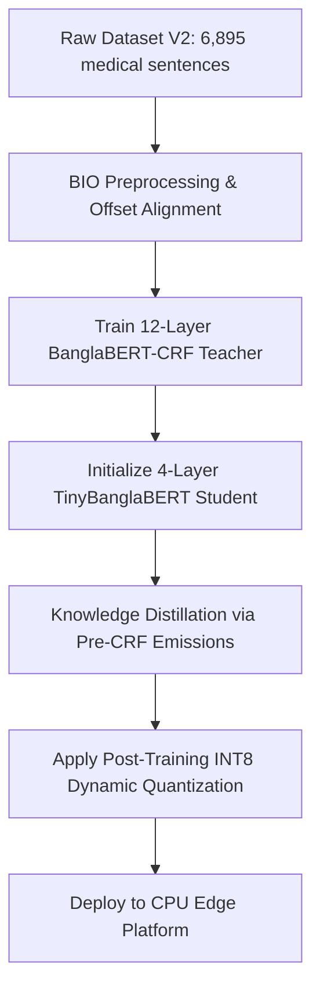
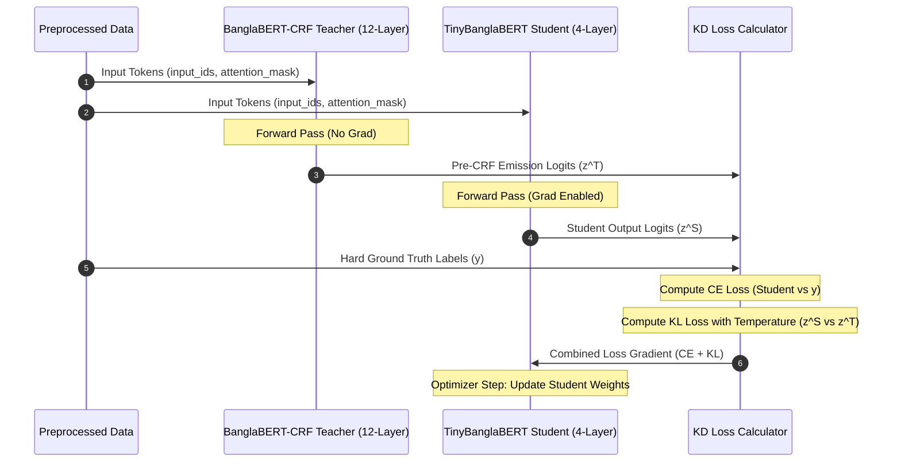

# A Lightweight Hybrid Transformer-CRF Architecture for Multi-Type Bangla Medical Entity Recognition

[](https://arxiv.org/abs/2605.25463)
[](https://opensource.org/licenses/MIT)
[](https://www.python.org/)
[](https://pytorch.org/)

Official implementation and documentation for the paper **"A Lightweight Hybrid Transformer-CRF Architecture for Multi-Type Bangla Medical Entity Recognition"** (arXiv:2605.25463 [cs.CL]).

---

## 📖 Preprint & Citation

If you use this codebase or refer to our research, please cite our preprint:

### Paper Information
- **Title:** A Lightweight Hybrid Transformer-CRF Architecture for Multi-Type Bangla Medical Entity Recognition
- **Authors:** Peyal Saha, Ahsanul Haque Hasib, Shoumik Barman Polok
- **Submitted:** May 25, 2026
- **Preprint Link:** [https://arxiv.org/abs/2605.25463](https://arxiv.org/abs/2605.25463)
- **DOI:** [https://doi.org/10.48550/arXiv.2605.25463](https://doi.org/10.48550/arXiv.2605.25463)

### BibTeX Citation
```bibtex
@misc{saha2026lightweighthybridtransformercrfarchitecture,
  title={A Lightweight Hybrid Transformer-CRF Architecture for Multi-Type Bangla Medical Entity Recognition}, 
  author={Peyal Saha and Ahsanul Haque Hasib and Shoumik Barman Polok},
  year={2026},
  eprint={2605.25463},
  archivePrefix={arXiv},
  primaryClass={cs.CL},
  url={https://arxiv.org/abs/2605.25463}, 
}
```

---

## 🚀 Key Features

* **Strict Exact-Boundary Evaluation**: Fully utilizes the `seqeval` library to evaluate complete multi-token entity spans rather than relaxed token-level accuracy (which is artificially inflated by grammatical "Outside" background tokens).
* **BanglaBERT+CRF Teacher Model**: Combines the contextual capacity of a 12-layer `BanglaBERT` backbone with a learnable transition matrix in a Conditional Random Field (CRF) layer to enforce globally valid BIO tag sequences.
* **Pre-CRF Knowledge Distillation**: A custom distillation loss function that extracts pre-CRF emission scores (logits before Viterbi decoding) from the teacher, transferring complex boundary constraints to the linear classification head of a lightweight student.
* **INT8 Dynamic Quantization**: Post-training weight quantization of linear layers to run high-performance inference on offline CPU platforms (e.g., standard servers or mobile backends).

---

## 📊 Pipeline Architecture & Sequence Flow

### 1. End-to-End Pipeline Flow
The following flowchart illustrates the transition from the raw dataset to the edge-deployed INT8 model:



### 2. Knowledge Distillation Sequence
The sequence diagram below shows how the teacher's boundary-aware emission logits are captured and distilled to guide the training of the lightweight student:



---

## 📈 Experimental Results

### Table 1: Entity Span Detection Performance (seqeval Test Set)
*Scores reflect complete exact-span matches. Background 'O' tokens are strictly excluded.*

| Model | Accuracy (%) | Precision (%) | Recall (%) | Macro F1 (%) |
| :--- | :---: | :---: | :---: | :---: |
| **Teacher (12L + CRF)** | 85.50 | 39.62 | 49.68 | **47.86** |
| **Student No-KD (4L)** | 85.14 | 37.02 | 45.70 | 40.90 |
| **Standard KD Student (4L)** | 85.12 | 38.18 | 46.56 | 41.96 |
| **CRF-KD Student (4L)** | **86.10** | **40.17** | **49.29** | **44.56** |
| **Quantized CRF-KD (INT8)** | 85.13 | 38.51 | 46.67 | 42.20 |

### Table 2: CPU Inference Efficiency (Simulated Edge Deployment)
*Measured on a standard workstation CPU (batch size = 1).*

| Model | Parameters | Model Size | CPU Latency | Relative Speedup |
| :--- | :---: | :---: | :---: | :---: |
| **Teacher (12L, no CRF)** | 163.8 M | 624.9 MB | 54.14 ms | $1.0\times$ (Baseline) |
| **CRF Teacher (12L+CRF)** | 164.4 M | 627.2 MB | 44.70 ms | $1.2\times$ |
| **CRF-KD Student (4L)** | 107.1 M | 408.6 MB | 15.73 ms | $3.4\times$ |
| **Quantized CRF-KD (INT8)** | **78.7 M** | **327.6 MB** | **6.28 ms** | **$8.6\times$** |

---

## 📂 Codebase & Project Directory Structure

```bash
├── config.py                           # Dataset and tag-to-ID configurations
├── crf_model.py                        # BanglaBERT+CRF PyTorch nn.Module architecture
├── 1_prepare_data.py                   # Preprocessing and BIO label alignment
├── 2_train_teacher.py                  # Fine-tuning code for non-CRF teacher baseline
├── 2_train_teacher_crf.py              # Fine-tuning code for BanglaBERT-CRF teacher
├── 3_create_student.py                 # Layer-selective initialization of the student
├── 4_train_student_no_kd.py            # Baseline student training (scratch / no KD)
├── 4_distill_student.py                # Standard KD framework (from non-CRF teacher)
├── 4_distill_student_from_crf.py       # Custom pre-CRF emission knowledge distillation
├── 5_quantize_benchmark.py             # Dynamic INT8 quantization script (standard KD student)
├── 5_quantize_benchmark_crf.py         # Quantization and latency benchmarks for CRF pipeline
├── 6_generate_tables.py                # Table generation script for F1/Accuracy scores
├── 7_detailed_eval.py                  # Script for class-wise, epoch-wise, and layer truncation evaluation
├── generate_figures.py                 # Matplotlib scripts to output paper figures
└── main.tex                            # LaTeX paper source code
```

---

## 🛠️ Installation & Setup

### 1. Requirements
Ensure you have a GPU environment for training (recommended) and PyTorch installed. Install dependencies via pip:

```bash
pip install torch transformers datasets evaluate seqeval pandas scikit-learn matplotlib pytorch-crf
```
*(Note: `pytorch-crf` is installed as `torchcrf`)*

### 2. Execution Pipeline
Run scripts sequentially to reproduce our findings:

1. **Preprocess and Align Data**:
   ```bash
   python 1_prepare_data.py
   ```
2. **Train CRF Teacher**:
   ```bash
   python 2_train_teacher_crf.py
   ```
3. **Initialize Student Architecture**:
   ```bash
   python 3_create_student.py
   ```
4. **Distill CRF Knowledge into Student**:
   ```bash
   python 4_distill_student_from_crf.py
   ```
5. **Quantize and Run Benchmarks**:
   ```bash
   python 5_quantize_benchmark_crf.py
   ```
6. **Detailed Evaluation**:
   ```bash
   python 7_detailed_eval.py
   ```
7. **Generate Figures**:
   ```bash
   python generate_figures.py
   ```

---

## 📜 License
This repository is licensed under the MIT License. See [LICENSE](LICENSE) for details.
